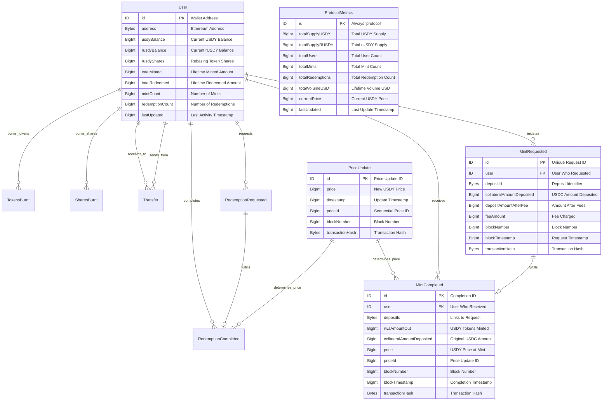

# Ondo USDY Dashboard

A comprehensive real-time analytics dashboard for Ondo Finance's USDY (US Dollar Yield) protocol, built with React and powered by real subgraph data.

## 🏦 About Ondo USDY

Ondo US Dollar Yield (USDY) is a tokenized note secured by short-term US Treasuries and bank demand deposits. It provides non-US individual and institutional investors with stablecoin-like accessibility while delivering high-quality, US dollar-denominated yield.

### Key Features:
- **Treasury-Backed**: Secured by short-term US Treasuries and bank deposits
- **Yield-Bearing**: Variable APY (~5%) based on Treasury yields
- **Global Access**: Available to non-US investors with KYC/KYB compliance
- **Multi-Chain**: Deployed on Ethereum, Arbitrum, Stellar, and more
- **Regulated**: SEC-compliant structure with bankruptcy-remote protection

## 📊 Dashboard Features

### Real-Time Metrics
- **Current Price**: $1.0908 (Live USDY price with yield appreciation tracking)
- **Total Volume**: $614M+ in protocol volume
- **User Analytics**: 841 total users across all chains
- **Mint Activity**: 221 completed mints with transaction history

### Interactive Visualizations
- **Price History Chart**: Treasury yield accumulation over time
- **Volume Analytics**: Monthly mint volume and activity trends
- **Top Holders**: Largest USDY positions and user rankings
- **Recent Activity**: Latest mint transactions and transfers

### Data Sources
- **Subgraph**: `QmQghLDa5TwSpewqvRFJ9epSDgLYzbcE4tRQys78m8LbLb`
- **Real-time Updates**: Live data from Ethereum mainnet
- **Multi-chain Support**: Aggregated data across supported networks

## 🏗️ Protocol Schema

The USDY protocol uses a sophisticated schema to track all protocol interactions:



## 📈 Key Metrics (Live Data)

| Metric | Value | Description |
|--------|-------|-------------|
| **Current Price** | $1.0908 | USDY price with Treasury yield |
| **Total Volume** | $614M+ | Lifetime protocol volume |
| **Total Users** | 841 | Non-US investors onboarded |
| **Total Mints** | 221 | Completed mint transactions |
| **APY Target** | ~5% | Variable rate based on Treasury yields |
| **Transfer Delay** | 40-50 days | After minting before transferable |

## 🚀 Getting Started

### Prerequisites
- Node.js 18+ and npm
- React 18+
- Access to Ethereum RPC endpoint

### Installation

1. Clone the repository:
```bash
git clone https://github.com/PaulieB14/Ondo-ETH-USDY.git
cd Ondo-ETH-USDY
```

2. Install dependencies:
```bash
npm install
```

3. Start the development server:
```bash
npm start
```

4. Open [http://localhost:3000](http://localhost:3000) to view the dashboard

### Dependencies
- **React**: Frontend framework
- **Recharts**: Chart visualizations
- **Tailwind CSS**: Styling framework
- **Lucide React**: Icons
- **GraphQL**: Subgraph data queries

## 📊 Real-Time Data Examples

### Recent Mint Activity
```json
{
  "timestamp": "1751838107",
  "amount": "3622.74",
  "user": "0x918e...b3c7",
  "date": "Jul 6, 2025"
}
```

### Price History
```json
{
  "timestamp": "1751064347",
  "price": "1.09607716",
  "priceId": "23",
  "date": "Jun 2025"
}
```

### Top User Example
```json
{
  "address": "0x7fbe...c74a9",
  "totalMinted": "146760295",
  "mintCount": "17",
  "balance": "-69080754"
}
```

## 🔒 Security & Compliance

### Regulatory Structure
- **Bankruptcy-Remote**: Ondo USDY LLC structured for investor protection
- **Verification Agent**: Ankura Trust Company oversight
- **SEC Compliance**: Designed for non-US investor regulations
- **KYC/KYB Required**: Full compliance for minting and redemption

### Important Restrictions
- ❌ **Not available to US persons**
- ⏳ **40-50 day transfer delay** after minting
- 🏦 **Treasury-backed** asset reserves
- 📋 **KYC/KYB verification** required

## 🌐 Multi-Chain Deployment

USDY is available across multiple blockchain networks:

- **Ethereum**: Primary deployment
- **Arbitrum**: Layer 2 scaling solution
- **Stellar**: Global payments network
- **Aptos**: Additional chain support

## 🛠️ Technical Architecture

### Frontend Stack
- **React 18**: Component-based UI
- **TypeScript**: Type-safe development
- **Tailwind CSS**: Utility-first styling
- **Recharts**: Data visualization
- **Responsive Design**: Mobile-first approach

### Data Integration
- **GraphQL Subgraph**: Real-time blockchain data
- **Ethereum Integration**: On-chain data fetching
- **Multi-chain Support**: Cross-chain data aggregation
- **Real-time Updates**: Live metric updates

## 🎯 Use Cases

### Individual Investors
- **Yield Generation**: Earn Treasury-backed returns
- **Dollar Stability**: Maintain USD exposure with yield
- **Portfolio Diversification**: Add regulated DeFi exposure

### Institutional Investors
- **Treasury Management**: Earn yield on idle funds
- **Cross-border Payments**: Efficient global transfers
- **Collateral Usage**: Use as collateral in DeFi protocols
- **Balance Sheet Optimization**: Improve capital efficiency

### Developers & Analysts
- **Portfolio Trackers**: Track individual user holdings and performance
- **Analytics Dashboards**: Protocol-wide metrics and trends
- **Yield Calculators**: Historical yield and APY calculations
- **Trading Interfaces**: Real-time price and liquidity data
- **Risk Management**: User activity and concentration metrics

## 📄 License

This project is licensed under the MIT License - see the [LICENSE](LICENSE) file for details.

## 🚨 Disclaimer

USDY is not available to US persons. This dashboard is for informational purposes only and does not constitute investment advice. USDY involves risks including potential loss of principal. Past performance does not indicate future results.

## 🤝 Contributing

1. Fork the repository
2. Create your feature branch (`git checkout -b feature/AmazingFeature`)
3. Commit your changes (`git commit -m 'Add some AmazingFeature'`)
4. Push to the branch (`git push origin feature/AmazingFeature`)
5. Open a Pull Request

## 📞 Support

For questions about the dashboard:
- Create an issue in this repository
- Review the [Ondo Finance documentation](https://ondo.finance/usdy)

For USDY protocol questions:
- Visit [ondo.finance/usdy](https://ondo.finance/usdy)
- Review official documentation and compliance requirements

---

**Built with ❤️ for the Ondo Finance community**

*Real-time data powered by subgraph: `QmQghLDa5TwSpewqvRFJ9epSDgLYzbcE4tRQys78m8LbLb`*