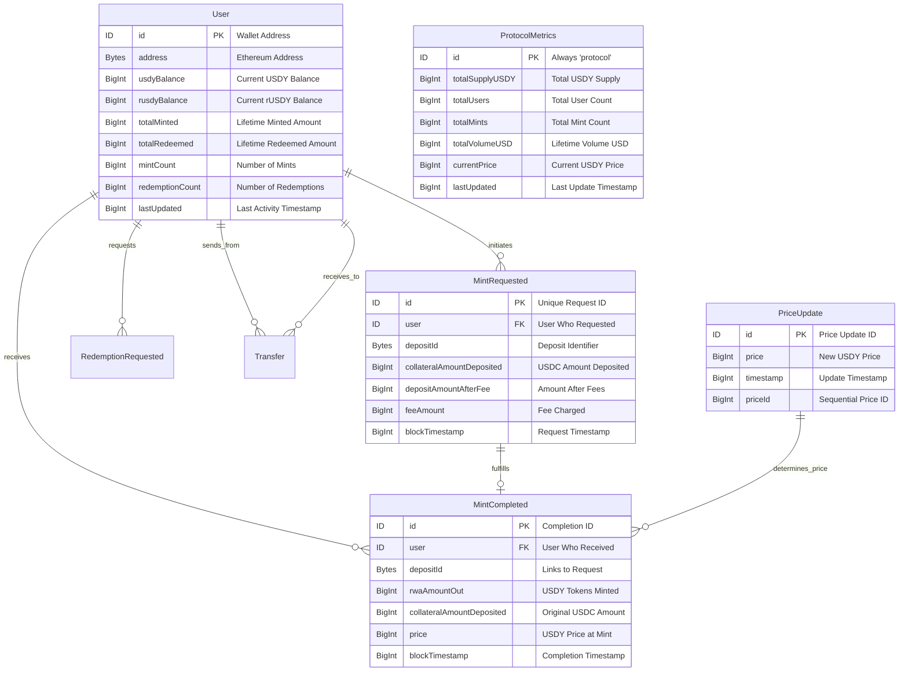

# Ondo USDY Analytics Platform

A comprehensive analytics platform for Ondo Finance's USDY (US Dollar Yield) protocol, featuring both subgraph indexing and interactive dashboard visualization powered by real blockchain data.

## 🏦 About Ondo USDY

Ondo US Dollar Yield (USDY) is a tokenized note secured by short-term US Treasuries and bank demand deposits. It provides non-US individual and institutional investors with stablecoin-like accessibility while delivering high-quality, US dollar-denominated yield.

### Key Features:
- **Treasury-Backed**: Secured by short-term US Treasuries and bank deposits
- **Yield-Bearing**: Variable APY (~5%) based on Treasury yields
- **Global Access**: Available to non-US investors with KYC/KYB compliance
- **Multi-Chain**: Deployed on Ethereum, Arbitrum, Stellar, and more
- **Regulated**: SEC-compliant structure with bankruptcy-remote protection


### Dashboard Features
- **Interactive Price Charts**: Treasury yield accumulation over time
- **Volume Analytics**: Monthly mint volume and activity trends
- **Top Holders**: Largest USDY positions and user rankings
- **Recent Activity**: Latest mint transactions and transfers
- **Real-time Updates**: Live data from subgraph `QmQghLDa5TwSpewqvRFJ9epSDgLYzbcE4tRQys78m8LbLb`

**📋 [View Complete Dashboard Documentation](DASHBOARD.md)**

## 🏗️ Protocol Schema

The USDY protocol uses a sophisticated schema to track all protocol interactions:



**📋 [View Complete Schema Documentation](SCHEMA.md)**

## 🔍 Subgraph Details

### Contracts Indexed

| Contract | Address | Description |
|----------|---------|-------------|
| USDY | `0x96F6eF951840721AdBF46Ac996b59E0235CB985C` | Main USDY token contract |
| rUSDY | `0xaf37c1167910ebC994e266949387d2c7C326b879` | Rebasing USDY token |
| USDYManager | `0x25A103A1D6AeC5967c1A4fe2039cdc514886b97e` | Handles mints and redemptions |
| Oracle | `0xA0219AA5B31e65Bc920B5b6DFb8EdF0988121De0` | Price oracle for USDY |

### Key Tracking Features

- **🔍 User Tracking**: Individual balances, mint/redemption history
- **💰 Transaction Monitoring**: All transfers, mints, and redemptions
- **📊 Protocol Analytics**: Real-time metrics and daily aggregations
- **🏦 Yield Calculations**: Price updates and APY tracking

## 📈 Example Queries

### Get Protocol Metrics
```graphql
{
  protocolMetrics(id: "protocol") {
    totalSupplyUSDY
    totalUsers
    totalMints
    totalVolumeUSD
    currentPrice
  }
}
```

### Get Recent Mints
```graphql
{
  mintCompleteds(first: 10, orderBy: blockTimestamp, orderDirection: desc) {
    user { id }
    rwaAmountOut
    collateralAmountDeposited
    price
    blockTimestamp
  }
}
```

### Get Top Users
```graphql
{
  users(first: 10, orderBy: totalMinted, orderDirection: desc) {
    id
    totalMinted
    totalRedeemed
    mintCount
  }
}
```


## 🎯 Use Cases

This platform enables building:

1. **📊 Analytics Dashboards** - Real-time protocol metrics and trends
2. **💼 Portfolio Trackers** - Individual user holdings and performance
3. **📈 Yield Calculators** - Historical yield and APY calculations
4. **🔄 Trading Interfaces** - Real-time price and liquidity data
5. **⚖️ Risk Management** - User activity and concentration metrics
6. **📋 Compliance Tools** - Transaction history and audit trails

## 🔒 Security & Compliance

### Important Restrictions
- ❌ **Not available to US persons**
- ⏳ **40-50 day transfer delay** after minting
- 🏦 **Treasury-backed** asset reserves
- 📋 **KYC/KYB verification** required


## 📄 Documentation

- **[Dashboard Guide](DASHBOARD.md)** - Complete dashboard features and setup
- **[Schema Documentation](SCHEMA.md)** - Detailed entity relationships and examples
- **[Ondo Finance Official](https://ondo.finance/usdy)** - Official USDY information

## 🤝 Contributing

1. Fork the repository
2. Create your feature branch (`git checkout -b feature/AmazingFeature`)
3. Commit your changes (`git commit -m 'Add some AmazingFeature'`)
4. Push to the branch (`git push origin feature/AmazingFeature`)
5. Open a Pull Request

## 📞 Support

For questions or issues:
- Create an issue in this repository
- Review the [Ondo Finance documentation](https://ondo.finance/usdy)
- Join the Ondo Finance Discord

## 🚨 Disclaimer

USDY is not available to US persons. This platform is for informational purposes only and does not constitute investment advice. USDY involves risks including potential loss of principal.

---

**Built with ❤️ for the Ondo Finance community**

*Real-time data powered by subgraph: `QmQghLDa5TwSpewqvRFJ9epSDgLYzbcE4tRQys78m8LbLb`*

**Note**: This subgraph indexes data from Ethereum mainnet starting from block 17672244 (USDY deployment block).
