# USDY Protocol Schema Documentation

This document provides a comprehensive overview of the Ondo USDY protocol's data schema, including entity relationships and data flow.

## Schema Overview

The USDY protocol schema is designed to track all interactions within the treasury-backed stablecoin ecosystem. The schema captures the complete user journey from initial mint requests through token transfers and redemptions.

## Entity Relationship Diagram

```mermaid
erDiagram
    %% Core User Entity - Central to all protocol interactions
    User ||--o{ MintRequested : "initiates"
    User ||--o{ MintCompleted : "receives"
    User ||--o{ RedemptionRequested : "requests"
    User ||--o{ RedemptionCompleted : "completes"
    User ||--o{ Transfer : "sends_from"
    User ||--o{ Transfer : "receives_to"
    User ||--o{ SharesBurnt : "burns_shares"
    User ||--o{ TokensBurnt : "burns_tokens"
    
    User {
        ID id PK "Wallet Address"
        Bytes address "Ethereum Address"
        BigInt usdyBalance "Current USDY Balance"
        BigInt rusdyBalance "Current rUSDY Balance"
        BigInt rusdyShares "Rebasing Token Shares"
        BigInt totalMinted "Lifetime Minted Amount"
        BigInt totalRedeemed "Lifetime Redeemed Amount"
        BigInt mintCount "Number of Mints"
        BigInt redemptionCount "Number of Redemptions"
        BigInt lastUpdated "Last Activity Timestamp"
    }
    
    %% Mint Process - Two-step process with 40-50 day delay
    MintRequested {
        ID id PK "Unique Request ID"
        ID user FK "User Who Requested"
        Bytes depositId "Deposit Identifier"
        BigInt collateralAmountDeposited "USDC Amount Deposited"
        BigInt depositAmountAfterFee "Amount After Fees"
        BigInt feeAmount "Fee Charged"
        BigInt blockNumber "Block Number"
        BigInt blockTimestamp "Request Timestamp"
        Bytes transactionHash "Transaction Hash"
    }
    
    MintCompleted {
        ID id PK "Completion ID"
        ID user FK "User Who Received"
        Bytes depositId "Links to Request"
        BigInt rwaAmountOut "USDY Tokens Minted"
        BigInt collateralAmountDeposited "Original USDC Amount"
        BigInt price "USDY Price at Mint"
        BigInt priceId "Price Update ID"
        BigInt blockNumber "Block Number"
        BigInt blockTimestamp "Completion Timestamp"
        Bytes transactionHash "Transaction Hash"
    }
    
    %% Redemption Process - Convert USDY back to USDC
    RedemptionRequested {
        ID id PK "Redemption Request ID"
        ID user FK "User Requesting"
        Bytes redemptionId "Redemption Identifier"
        BigInt rwaAmountIn "USDY Amount to Redeem"
        BigInt blockNumber "Block Number"
        BigInt blockTimestamp "Request Timestamp"
        Bytes transactionHash "Transaction Hash"
    }
    
    RedemptionCompleted {
        ID id PK "Redemption Completion ID"
        ID user FK "User Who Redeemed"
        Bytes redemptionId "Links to Request"
        BigInt rwaAmountRequested "USDY Amount Requested"
        BigInt collateralAmountReturned "USDC Amount Returned"
        BigInt price "USDY Price at Redemption"
        BigInt blockNumber "Block Number"
        BigInt blockTimestamp "Completion Timestamp"
        Bytes transactionHash "Transaction Hash"
    }
    
    %% Transfer Events - Token movements between users
    Transfer {
        ID id PK "Transfer ID"
        ID from FK "Sender Address"
        ID to FK "Recipient Address"
        BigInt amount "Amount Transferred"
        String token "Token Type USDY/rUSDY"
        BigInt blockNumber "Block Number"
        BigInt blockTimestamp "Transfer Timestamp"
        Bytes transactionHash "Transaction Hash"
    }
    
    %% Price Updates - Treasury yield accumulation
    PriceUpdate {
        ID id PK "Price Update ID"
        BigInt price "New USDY Price"
        BigInt timestamp "Update Timestamp"
        BigInt priceId "Sequential Price ID"
        BigInt blockNumber "Block Number"
        Bytes transactionHash "Transaction Hash"
    }
    
    %% Protocol-wide metrics for dashboard
    ProtocolMetrics {
        ID id PK "Always 'protocol'"
        BigInt totalSupplyUSDY "Total USDY Supply"
        BigInt totalSupplyRUSDY "Total rUSDY Supply"
        BigInt totalUsers "Total User Count"
        BigInt totalMints "Total Mint Count"
        BigInt totalRedemptions "Total Redemption Count"
        BigInt totalVolumeUSD "Lifetime Volume USD"
        BigInt currentPrice "Current USDY Price"
        BigInt lastUpdated "Last Update Timestamp"
    }
    
    %% Daily aggregated statistics
    DailyProtocolStats {
        ID id PK "timestamp / 86400"
        BigInt date "Date of Statistics"
        BigInt totalSupplyUSDY "USDY Supply That Day"
        BigInt totalSupplyRUSDY "rUSDY Supply That Day"
        BigInt totalMints "Mints That Day"
        BigInt totalRedemptions "Redemptions That Day"
        BigInt volumeUSD "Volume That Day"
        BigInt averagePrice "Average Price That Day"
        BigInt uniqueUsers "Unique Users That Day"
        BigInt newUsers "New Users That Day"
    }
    
    %% Interest rate ranges for yield calculation
    RangeSet {
        ID id PK "Range Set ID"
        BigInt index "Range Index"
        BigInt start "Range Start Time"
        BigInt end "Range End Time"
        BigInt dailyInterestRate "Daily Interest Rate"
        BigInt prevRangeClosePrice "Previous Range Close Price"
        BigInt blockNumber "Block Number"
        BigInt blockTimestamp "Set Timestamp"
        Bytes transactionHash "Transaction Hash"
    }
    
    %% Token burn events for rebasing mechanism
    SharesBurnt {
        ID id PK "Burn Event ID"
        ID user FK "User Who Burned"
        BigInt preRebaseTokenAmount "Tokens Before Rebase"
        BigInt postRebaseTokenAmount "Tokens After Rebase"
        BigInt sharesAmount "Shares Burned"
        BigInt blockNumber "Block Number"
        BigInt blockTimestamp "Burn Timestamp"
        Bytes transactionHash "Transaction Hash"
    }
    
    TokensBurnt {
        ID id PK "Token Burn ID"
        ID user FK "User Who Burned"
        BigInt burnAmount "Amount Burned"
        BigInt blockNumber "Block Number"
        BigInt blockTimestamp "Burn Timestamp"
        Bytes transactionHash "Transaction Hash"
    }
    
    %% Relationships between mint request and completion
    MintRequested ||--o| MintCompleted : "fulfills"
    RedemptionRequested ||--o| RedemptionCompleted : "fulfills"
    
    %% Price updates affect mint/redemption prices
    PriceUpdate ||--o{ MintCompleted : "determines_price"
    PriceUpdate ||--o{ RedemptionCompleted : "determines_price"
```



## Core Entities

### User Entity
The central entity tracking all user interactions within the protocol.

**Key Features:**
- Tracks both USDY and rUSDY balances
- Maintains lifetime statistics (total minted/redeemed)
- Links to all user activities via foreign key relationships
- Supports rebasing token mechanics through shares tracking

**Use Cases:**
- Portfolio tracking and analytics
- User behavior analysis
- Compliance reporting
- Risk management

### Mint Process Entities

#### MintRequested
Tracks the initial user request to mint USDY tokens.

**Important Notes:**
- Deposits are typically in USDC
- Fee structure is transparent
- Links to completion via `depositId`

#### MintCompleted
Records the completion of a mint request after the 40-50 day delay.

**Key Fields:**
- `rwaAmountOut`: The actual USDY tokens received
- `price`: The USDY price at time of mint
- `priceId`: Links to the specific price update

### Redemption Process Entities

#### RedemptionRequested
Tracks user requests to redeem USDY for USDC.

#### RedemptionCompleted
Records completed redemptions with final amounts.

**Note:** Currently, the protocol shows 0 redemptions in the live data, indicating strong user confidence in holding USDY.

### Transfer Entity
Tracks all token movements between users.

**Features:**
- Supports both USDY and rUSDY transfers
- Complete audit trail with transaction hashes
- Enables network analysis and flow tracking

### Price Update Entity
Critical for tracking Treasury yield accumulation.

**Importance:**
- Shows steady price appreciation over time
- Enables APY calculations
- Links to mint/redemption pricing

### Analytics Entities

#### ProtocolMetrics
Singleton entity providing real-time protocol statistics.

**Current Values (Live Data):**
- Total Users: 841
- Total Mints: 221
- Total Volume: $614M+
- Current Price: $1.0908

#### DailyProtocolStats
Time-series data for historical analysis.

**Use Cases:**
- Trend analysis
- Growth metrics
- Performance reporting

## Data Flow

### 1. User Onboarding
```
User Registration → KYC/KYB Verification → User Entity Creation
```

### 2. Mint Process
```
MintRequested → 40-50 Day Delay → MintCompleted → User Balance Update
```

### 3. Price Updates
```
Treasury Yield Changes → Oracle Price Update → PriceUpdate Entity → Impact on Future Mints
```

### 4. Transfer Flow
```
Transfer Initiated → Transfer Entity Created → User Balances Updated
```

## Key Relationships

### User-Centric Design
- All protocol interactions are tied to the User entity
- Enables comprehensive user journey tracking
- Supports both individual and institutional analysis

### Process Tracking
- Mint/Redemption requests are linked to their completions
- Price updates determine mint/redemption rates
- Complete audit trail for compliance

### Analytics Integration
- Daily stats aggregate from individual transactions
- Protocol metrics provide real-time dashboard data
- Historical data enables trend analysis

## Usage Examples

### Portfolio Tracking
```graphql
query GetUserPortfolio($address: String!) {
  user(id: $address) {
    usdyBalance
    rusdyBalance
    totalMinted
    totalRedeemed
    subscriptions(first: 10) {
      collateralAmountDeposited
      blockTimestamp
    }
  }
}
```

### Protocol Analytics
```graphql
query GetProtocolMetrics {
  protocolMetrics(id: "protocol") {
    totalUsers
    totalMints
    totalVolumeUSD
    currentPrice
  }
}
```

### Price History
```graphql
query GetPriceHistory {
  priceUpdates(first: 100, orderBy: timestamp, orderDirection: desc) {
    price
    timestamp
    priceId
  }
}
```

## Best Practices

### For Developers
1. **Always use proper relationships** when querying related entities
2. **Implement pagination** for large datasets
3. **Handle BigInt values** appropriately in frontend applications
4. **Cache frequently accessed data** like protocol metrics

### For Analysts
1. **Use timestamp fields** for time-series analysis
2. **Aggregate data** using daily stats for performance
3. **Track user journeys** through linked entities
4. **Monitor price trends** for yield calculations

## Security Considerations

### Data Privacy
- User addresses are public blockchain data
- No personal information is stored in the subgraph
- Compliance with KYC/KYB handled off-chain

### Data Integrity
- All data is sourced from verified smart contracts
- Transaction hashes provide verifiable audit trails
- Price updates come from trusted oracles

---

**Schema Version**: Latest
**Last Updated**: July 2025
**Subgraph**: `QmQghLDa5TwSpewqvRFJ9epSDgLYzbcE4tRQys78m8LbLb`